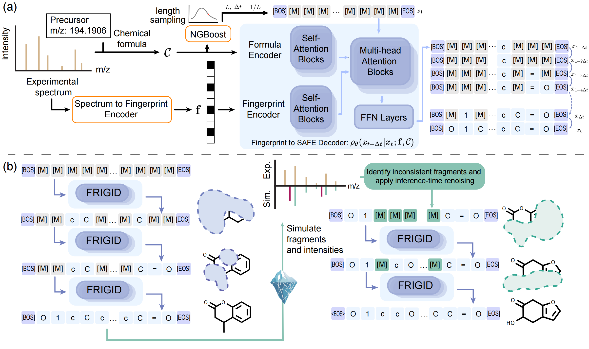
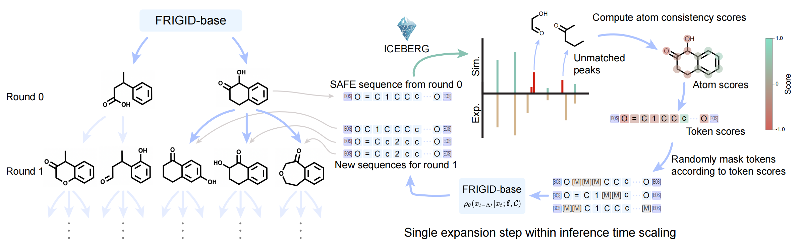
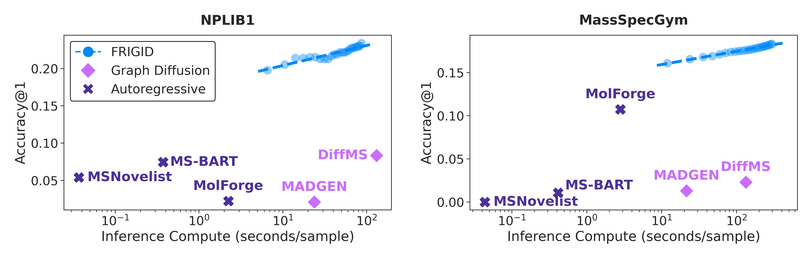

# FRIGID: Scaling Diffusion-Based Molecular Generation from Mass Spectra at Training and Inference Time

This is the codebase for our preprint [FRIGID: Scaling Diffusion-Based Molecular Generation from Mass Spectra at Training and Inference Time](https://arxiv.org/abs/2604.16648). **FRIGID** is a diffusion language model (DLM) framework for *de novo* structural elucidation from tandem mass spectra (MS/MS). Given an observed spectrum, FRIGID generates molecular structures as SAFE sequences conditioned on intermediate fingerprint representations and chemical formulae, with optional iterative refinement guided by a forward fragmentation model (ICEBERG).

<p align="center">
  
  <br>
  <em>FRIGID architecture and pipeline overview. (a) FRIGID-base: Spectrum → fingerprint (MIST) + formula → diffusion decoder. (b) ICEBERG-guided inference-time refinement.</em>
</p>

The FRIGID codebase is adapted from [GenMol](https://github.com/NVIDIA-Digital-Bio/genmol). 

---

## Overview

Tandem mass spectrometry (MS/MS) is central to small molecule identification in metabolomics, drug discovery, and environmental chemistry. While retrieval-based pipelines are limited to known chemical libraries, *de novo* elucidation models can propose novel structures directly from spectra.

FRIGID addresses two key limitations of prior work: poor scalability at training time and the absence of automatic correction mechanisms at inference time.

**Key contributions:**

1. **FRIGID-base**: A masked diffusion language model (MDLM) that generates SAFE molecular strings conditioned on predicted Morgan fingerprints (via MIST) and chemical formulae (via cross-attention). Trained on up to 230 million unlabeled structures, FRIGID-base achieves strong results through pretraining-scale improvements alone.

2. **ICEBERG-guided inference-time scaling**: A cycle-consistent refinement pipeline that uses ICEBERG (a forward fragmentation model) to simulate spectra of generated candidates, identify hallucinated fragments, and iteratively remask and re-denoise inconsistent substructures. This yields a clear log-linear relationship between inference compute and identification accuracy.

3. **State-of-the-art results** on NPLIB1 and MassSpecGym benchmarks, more than doubling the Top-1 accuracy of prior methods on NPLIB1 and surpassing 15% Top-1 accuracy on MassSpecGym with inference-time scaling.

---

## How It Works

### Stage 1: FRIGID-base — Spectrum-Conditioned Diffusion Generation

FRIGID-base is a BERT-style MDLM that generates molecular SAFE sequences conditioned on two signals derived from the input spectrum:

- **Fingerprint conditioning**: MIST encoder predicts a 4096-bit radius-2 Morgan fingerprint from the spectrum. Active bit indices are embedded and processed through 3 self-attention layers, then injected via cross-attention into every Transformer block.
- **Formula conditioning**: The precursor chemical formula (inferred from MS1) is encoded as a per-element count embedding sequence, also injected via shared cross-attention.
- **Length prediction**: An NGBoost model predicts the distribution of SAFE token lengths for a given formula, enabling sampling of an appropriate sequence length before denoising.

### Stage 2: ICEBERG-Guided Inference-Time Scaling

After initial generation, FRIGID applies iterative spectrum-structure cycle-consistency refinement:

1. Generate a batch of candidate structures with FRIGID-base (Round 0).
2. Rank candidates by Tanimoto similarity to the predicted fingerprint and select top-M.
3. For each candidate, run ICEBERG to simulate its MS/MS spectrum.
4. Compare simulated peaks against the experimental spectrum; peaks present in simulation but absent in experiment are flagged as *hallucinations*.
5. Compute atom-wise consistency scores and aggregate to token-level masking probabilities.
6. Randomly remask inconsistent tokens and re-denoise with FRIGID-base to produce refined candidates.
7. Repeat for R rounds, accumulating a growing pool of unique candidates.

<p align="center">
  
  <br>
  <em>ICEBERG-guided inference-time scaling: atom consistency scores, token masking, and re-denoising of inconsistent substructures.</em>
</p>

---

## Results

Performance on NPLIB1 and MassSpecGym (known chemical formula setting):

<p align="center">
  
  <br>
  <em>Top-1 accuracy vs. inference compute on NPLIB1 (left) and MassSpecGym (right). FRIGID exhibits clear log-linear scaling across refinement rounds.</em>
</p>

| Model | NPLIB1 Top-1 Acc | NPLIB1 Top-10 Acc | MSG Top-1 Acc | MSG Top-10 Acc |
|---|---|---|---|---|
| MIST + MSNovelist | 5.40% | 11.04% | 0.00% | 0.00% |
| MS-BART | 7.45% | 10.99% | 1.07% | 1.11% |
| DiffMS | 8.34% | 15.44% | 2.30% | 4.25% |
| MIST + MolForge | 2.24% | 5.11% | 10.73% | 14.48% |
| **FRIGID-base (ours)** | **19.80%** | **24.41%** | **16.09%** | **18.19%** |
| **FRIGID (ours)** | **25.03%** | **33.37%** | **18.29%** | **22.00%** |

FRIGID is also **20× faster** than DiffMS at inference (6.58 s/spectrum vs. 131.2 s/spectrum on a single NVIDIA 6000 Ada GPU), enabling practical large-scale inference-time scaling.

---

## Repository Structure

```
frigid/
├── src/
│   ├── dlm/                            # FRIGID-base DLM and ICEBERG sampler
│   │   ├── model.py                    # DLM Lightning module (MDLM)
│   │   ├── sampler.py                  # Generation and sampling logic
│   │   ├── iceberg_sampler.py          # ICEBERG-guided inference-time scaling
│   │   ├── model_components.py         # Formula and fingerprint conditioners
│   │   ├── bert_with_cross_attention.py# Modified BERT backbone
│   │   ├── spec2mol_model.py           # Combined MIST+DLM pipeline
│   │   └── utils/
│   │       ├── utils_chem.py           # SAFE/SMILES chemistry utilities
│   │       ├── masking_utils.py        # Token masking for ICEBERG refinement
│   │       ├── benchmark_utils.py      # Evaluation metrics
│   │       └── formula_encoder.py      # Chemical formula encoding
│   └── mist/                           # MIST fingerprint encoder
│       ├── models/
│       │   ├── spectra_encoder.py      # MS/MS → fingerprint model
│       │   └── modules.py              # FormulaTransformer, attention blocks
│       └── data/
│
├── ms-pred/                            # ICEBERG forward model (git submodule)
│
├── scripts/
│   ├── train.py                        # FRIGID-base pretraining
│   ├── benchmark_spec2mol.py           # End-to-end benchmark (no scaling)
│   ├── spec2mol_scaling.py             # ICEBERG inference-time scaling
│   ├── compute_metrics.py              # Metric computation from saved results
│   ├── run_scaling_multi_gpu.py        # Multi-GPU scaling runner
│   └── multi_compute.py               # Multi-process compute utilities
│
├── configs/
│   ├── fp2mol_pretraining.yaml                # FRIGID-base pretraining config
│   ├── spec2mol_benchmark_canopus.yaml        # NPLIB1 benchmark config
│   └── spec2mol_benchmark_msg.yaml            # MassSpecGym benchmark config
│
├── token_models/                       # NGBoost length prediction models
│   ├── README.md                       # Training guide for token models
│   ├── train_opt_canopus.py            # Train on NPLIB1/CANOPUS data
│   ├── train_opt_msg.py                # Train on MassSpecGym data
│   ├── train_opt_canopus_pubchem.py    # Train with PubChem auxiliary data
│   ├── train_opt_msg_pubchem.py        # Train with PubChem auxiliary data
│   └── models/                         # Saved .joblib model files
│
├── data/
│   ├── canopus/                        # NPLIB1/CANOPUS dataset
│   ├── msg/                            # MassSpecGym dataset
│   └── exclude_inchikeys.csv           # Test/val InChIKeys excluded from training
│
├── checkpoints/                        # Pretrained model checkpoints
│   └── iceberg/                        # ICEBERG model weights
│
└── assets/                             # Paper figures
    ├── fig1_model_overview.png
    ├── fig2_iceberg_mechanism.png
    └── fig3_inference_scaling.png
```

---

## Installation

```bash
# Clone the repository (with ICEBERG submodule)
git clone --recurse-submodules <repo-url>
cd frigid

# If you cloned without --recurse-submodules
git submodule update --init --recursive

# Create conda environment
conda create -n frigid python=3.10
conda activate frigid

# Install dependencies
pip install -r ms-pred/requirements.txt
pip install -e ./ms-pred
pip install -e .

# (Optional) Install optuna for training NGBoost token models
pip install optuna
```

---

## Usage

### 1. Pretraining FRIGID-base

Train the MDLM backbone on a large corpus of unlabeled SAFE sequences. The training config specifies dataset paths, model architecture, and optimization settings:

```bash
python scripts/train.py --config configs/fp2mol_pretraining.yaml
```

Key configuration options in `configs/fp2mol_pretraining.yaml`:
- `data.hf_cache_dir`: path to the SAFE dataset (HuggingFace cache)
- `data.exclude_inchikeys_file`: path to `data/exclude_inchikeys.csv` to mask test structures
- `trainer.max_steps`: total optimization steps (default: 500,000)
- `loader.global_batch_size`: global batch size (default: 2048; scales across GPUs)
- `model.hidden_size` / `model.num_hidden_layers`: BERT backbone dimensions
- `training.ema`: EMA decay for parameter averaging (default: 0.9999)

### 2. Training NGBoost Token Length Models

FRIGID-base requires an NGBoost model to predict SAFE sequence lengths from molecular formulae. See `token_models/README.md` for full details.

```bash
cd token_models/

# Option A: train directly on benchmark data (fast)
python train_opt_canopus.py   # for NPLIB1
python train_opt_msg.py       # for MassSpecGym

# Option B: train with PubChem auxiliary data (recommended)
bash download_pubchem.sh
python generate_training_data.py
python train_opt_canopus_pubchem.py
python train_opt_msg_pubchem.py
```

Trained models are saved to `token_models/models/`.

### 3. Running the Benchmark (without Inference-Time Scaling)

Evaluate FRIGID-base end-to-end on NPLIB1 or MassSpecGym:

```bash
# NPLIB1 / CANOPUS benchmark
python scripts/benchmark_spec2mol.py \
    --config configs/spec2mol_benchmark_canopus.yaml \
    --mist-checkpoint checkpoints/mist_canopus.pt \
    --dlm-checkpoint checkpoints/frigid_base.ckpt

# MassSpecGym benchmark
python scripts/benchmark_spec2mol.py \
    --config configs/spec2mol_benchmark_msg.yaml \
    --mist-checkpoint checkpoints/mist_msg.pt \
    --dlm-checkpoint checkpoints/frigid_base.ckpt
```

### 4. ICEBERG Inference-Time Scaling

Run the full FRIGID pipeline with cycle-consistent refinement over multiple rounds:

```bash
python scripts/spec2mol_scaling.py \
    --config configs/spec2mol_benchmark_canopus.yaml \
    --mist-checkpoint checkpoints/mist_canopus.pt \
    --dlm-checkpoint checkpoints/frigid_base.ckpt \
    --iceberg-gen-ckpt checkpoints/iceberg/dag_gen.ckpt \
    --iceberg-inten-ckpt checkpoints/iceberg/dag_inten.ckpt \
    --num-rounds 10 \
    --batch-size 128
```

Key scaling parameters:
- `--num-rounds`: number of refinement rounds R (default: 10; paper uses up to 25)
- `--batch-size`: candidates generated per round B (default: 128)
- The script also accepts `--top-k` (top-M candidates selected per round) and `--num-renoised` (N masked variants per candidate)

---

## Model Architecture Details

### FRIGID-base MDLM

The decoder is a 12-layer BERT Transformer (hidden size 768, 12 heads, FFN dimension 3072) modified with cross-attention sublayers in each block:

| Component | Details |
|---|---|
| Backbone | BERT, 12 layers, d=768, H=12 |
| Total parameters | 182.2M |
| Vocabulary | BPE-tokenized SAFE, \|V\|=1880 |
| Max token length | 256 |
| Formula encoder | Per-element count embedding (30 elements) |
| Fingerprint encoder | Active-bit set encoder, 3-layer self-attention |
| Cross-attention | Shared pathway for formula + fingerprint |
| Noise schedule | Log-linear MDLM, continuous time |

### MIST Encoder

A FormulaTransformer-based encoder that maps MS/MS peak-formula pairs to 4096-bit Morgan fingerprint probabilities.

### ICEBERG Forward Model

A two-stage model (fragment generator + intensity predictor) trained on bond-breaking fragment enumeration via MAGMa. Separate ICEBERG models are trained on the training split of each benchmark to avoid leakage. At inference, spectra are simulated at collision energies {10–90 eV} and matched against experimental peaks within 20 ppm.

## Pretrained Checkpoints

Pretrained checkpoints for the FRIGID decoder, the MIST encoders, and the ICEBERG models are available [here](https://zenodo.org/records/19685145).

## License

FRIGID is released under the [Apache 2.0](LICENSE/license_code.txt) license.

## Contact

If you have any questions, please reach out to mbohde@tamu.edu or liuhx25@mit.edu.

---

## Citation

If you find this codebase useful in your research, please kindly cite the following manuscript:
```bibtex
@misc{frigid2026,
      title={FRIGID: Scaling Diffusion-Based Molecular Generation from Mass Spectra at Training and Inference Time}, 
      author={Montgomery Bohde and Hongxuan Liu and Mrunali Manjrekar and Magdalena Lederbauer and Shuiwang Ji and Runzhong Wang and Connor W. Coley},
      year={2026},
      eprint={2604.16648},
      archivePrefix={arXiv},
      primaryClass={cs.LG},
      url={https://arxiv.org/abs/2604.16648}, 
}
```

---

## Acknowledgements

FRIGID builds on [GenMol](https://arxiv.org/abs/2501.06158) (NVIDIA), [MIST](https://www.nature.com/articles/s42256-023-00708-3), [ICEBERG](https://www.biorxiv.org/content/10.1101/2025.01.09.631755), and the [SAFE](https://arxiv.org/abs/2310.10773) molecular representation. Datasets: [NPLIB1](https://doi.org/10.1038/s41587-020-0740-8), [MassSpecGym](https://arxiv.org/abs/2410.23326).
